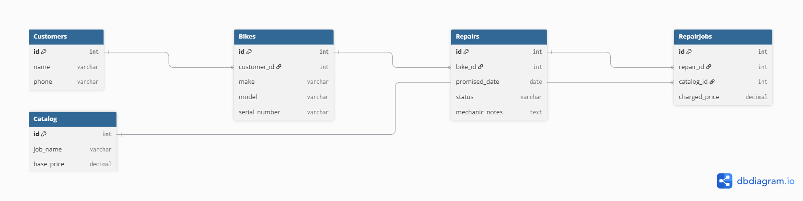

# Domain Model

## 1. Relational Diagram


## 2. DBML Code
```dbml
Table Customers {
  id int [pk]
  name varchar
  phone varchar
}

Table Bikes {
  id int [pk]
  customer_id int [ref: > Customers.id]
  make varchar
  model varchar
  serial_number varchar 
}

Table Catalog {
  id int [pk]
  job_name varchar
  base_price decimal
}

Table Repairs {
  id int [pk]
  bike_id int [ref: > Bikes.id]
  promised_date date
  status varchar 
  mechanic_notes text
}

Table RepairJobs {
  id int [pk]
  repair_id int [ref: > Repairs.id]
  catalog_id int [ref: > Catalog.id]
  charged_price decimal 
}

## 3. Lifecycle of a Repair
**States a repair goes through:**
1. `Received` (Bike dropped off, tag created)
2. `Estimating` (Mechanic inspecting the bike)
3. `Waiting for Approval` (Customer contacted, awaiting response)
4. `Approved` (Customer said yes) / `Declined` (Customer said no)
5. `In Progress` (Mechanic working on the bike)
6. `Completed` (Work is done, ready for pickup)
7. `Picked Up` (Customer took the bike and paid, closed)

**Allowed Transitions:**
* `Received` -> `Estimating`
* `Estimating` -> `Waiting for Approval`
* `Waiting for Approval` -> `Approved` OR `Declined`
* `Approved` -> `In Progress`
* `In Progress` -> `Completed`
* `Completed` -> `Picked Up`
* `Declined` -> `Picked Up` (They pick it up the way it arrived)

**Transitions NOT Allowed:**
* `Completed` -> `In Progress` (Once finished, it cannot go back to being worked on without opening a new repair ticket).
* `Picked Up` -> ANY (Once picked up, the repair is permanently closed).

## 4. Entity Trace
Every entity traces back to a user story from our `user-stories.md` file:

| Entity | Story that requires it |
|---|---|
| **Customers** | Epic: "Someone walks in, we write their name and phone..." |
| **Bikes** | Story 4: "As Counter Staff, I want to log the bike's make, model, and serial number..." |
| **Catalog** | Story 6: "As an Owner, I want the price list published on the website..." |
| **Repairs** | Epic: "As a Mechanic, I want to manage a repair from start to finish..." |
| **RepairJobs** | Story 9: "As a Mechanic, I want to add specific catalog jobs to a repair..." |

## 5. Design Decisions

### The thing and the copy of the thing
The owner explicitly mentioned confusing two blue Trek Marlins in March. To prevent this, our model uses a unique `serial_number` in the `Bikes` table to identify the specific, physical object (the "copy"). If we just had a single table for "Bicycle Models" with a `quantity` column, we would only know we have "two blue Marlins in the shop", but we wouldn't be able to track which specific bike belongs to which customer, leading to handing the wrong bike back again.

### Derived, or stored?
**Derived (Deliberately not stored):** The `total_invoice_price` for a repair is not stored as a column in the `Repairs` table. Instead, it is derived by summing the `charged_price` of all associated `RepairJobs`. This prevents data inconsistency where a total might not match the sum of its parts. 
**Stored (Instead of derived):** The `charged_price` in `RepairJobs` looks like it could be derived directly from the `Catalog`'s `base_price`. However, we deliberately stored it. If we didn't, every time the catalog prices are updated in January, all past repair invoices from previous years would dynamically recalculate and change to the new prices, ruining the shop's financial records.