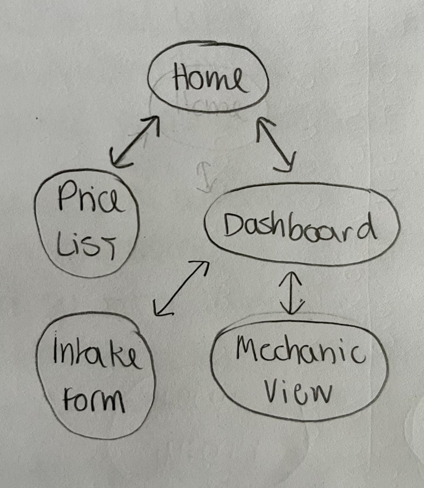
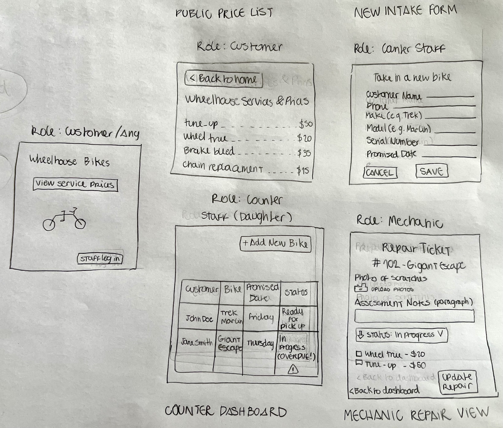

# Wireframes & Navigation

These low-fidelity wireframes map out the core screens required for the Wheelhouse system, explicitly naming the role for each view. 

## Navigation Graph
Every screen is reachable and there are no dead ends. The public and private areas are logically connected.

---

## The Screens
Below are the low-fidelity sketches for the 5 core screens of the application.

### 1. Public Home
* **Role:** Customer / Any
* **Purpose:** The entry point to the website. Provides access to the price list and a discrete login link for staff to access the internal system.

### 2. Public Price List
* **Role:** Customer
* **Purpose:** Satisfies the owner's request: *"The wall list should be on the website too, so people stop phoning to ask what a tune-up costs."*

### 3. Counter Dashboard
* **Role:** Counter Staff (Daughter)
* **Purpose:** This is the core screen that answers the owner's requirement: *"When a customer calls to ask if their bike is ready, whoever picks up the phone has to walk to the back and find out. I would like that on a screen."* It shows overdue bikes and current statuses at a glance.

### 4. New Intake Form
* **Role:** Counter Staff
* **Purpose:** Used when a bike arrives. Captures customer details and specifically the **serial number** to prevent mixing up identical bikes (like the two blue Trek Marlins).

### 5. Mechanic Repair View
* **Role:** Mechanic
* **Purpose:** Allows the mechanic to upload pre-repair photos (to avoid scratch disputes), write readable assessment paragraphs, and add specific catalog jobs to build the final invoice.